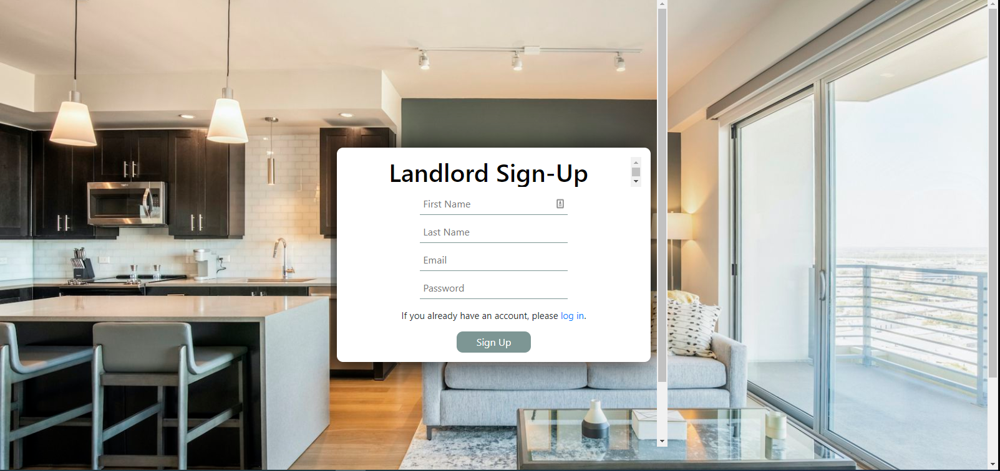
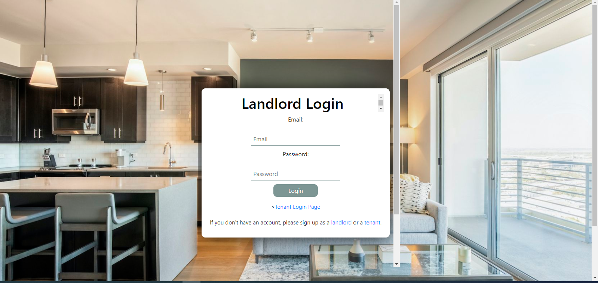
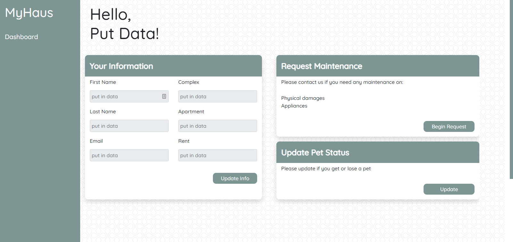

# MyHaus
   # MY Haus Landord/Tenant Interface
  

badges();
## Table of Contents
* [Description](#description)
* [Installation](#installation)
* [Usage](#usage)
* [Testing](#testing)
* [License](#license)
* [Contributors](#contributors)
* [Images](#Images)
* [Deployment](#deployment)
* [Questions](#questions)

## Description:
The app does 2 seperate things. First it  allows landlords to track thier tenants and properties. Second, it is a portal for tenants to make urgent maintenance requests as well as other non urgent notifications to the landlord. It builds a database for the landlord to be able to track thier tenants rent, roommates, pets and other important information.

## Installation:
Clone from Github repository. Install needed npm packages. 

## Usage:
Also be sure to run MySql (mysql -u root -p) and type in “source db/schema.sql;” to connect the database.
Start from the terminal using npm start command.

## Testing
To test in the browser you will  go to localhost:3001/signup and follow directions.

## License:
This Repository is covered under the following license: [ISC] 

## Contributors:
Tara Brichetto, Joseph DeFelice, Richard Flores, Stephen Pena, Chris Walston 

## Images:

## Deployment:

## Questions:
Contact me:
Github: [https://github.com/penaone](https://github.com/penaone)
Email: [penaone@gmail.com](penaone@gmail.com)

