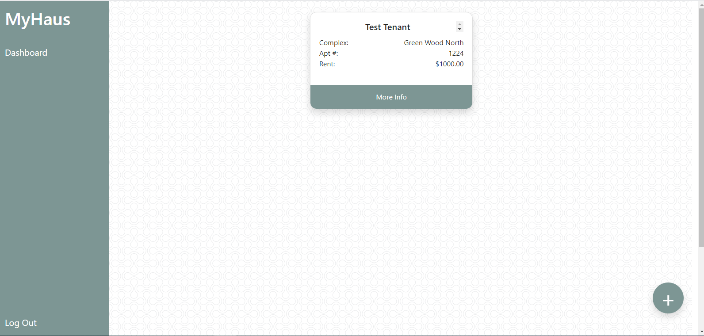
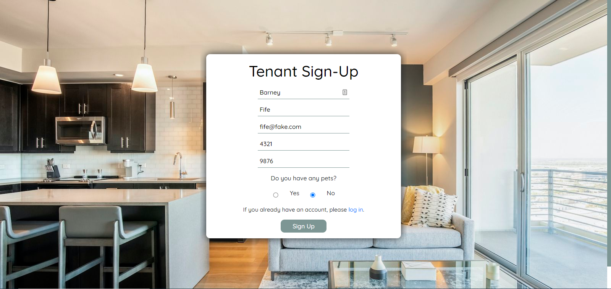
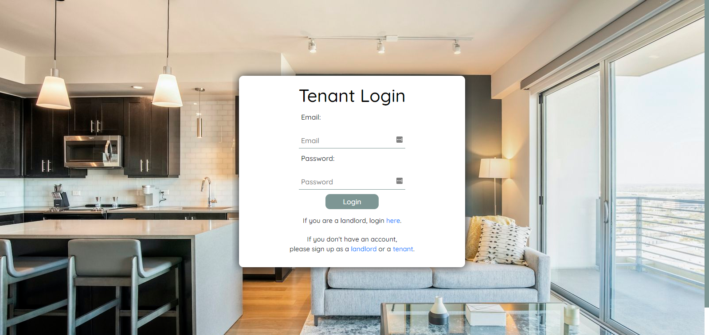

# MyHaus

## Table of Contents
* [Description](#description)
* [Installation](#installation)
* [Usage](#usage)
* [License](#license)
* [Contributors](#contributors)
* [Tests](#tests)
* [Questions](#questions)

## Description:
The app consists of two user portals: one that allows landlords to manage their properties and tenants, and a second that allows tenants to submit routine maintenance requests and pet updates for landlord review. 

## Installation:
1. Clone from Github repository.  
2. Install required npm packages:  
* Node.js  
* Express  
* Express-Session  
* Express-Handlebars  
* Handlebars  
* Sequelize  
* Bcrypt  
* Dotenv  
* MySql2  
* Connect-Session Sequelize  
* Nodemon (recommended) 
3. Run MySql and source the database. (Command: "source db/schema.sql;) 

## Usage:
Through Local Server: 
1. Start from the terminal using "npm start" command.  
2. Go to "localhost:3001/signup" in the browser to access app.  
 
Through Deployed Application: 
1. Go to "https://myhaus.herokuapp.com/" in the browser to access app. 

## License:
This Repository is covered under the following license: [ISC] 

## Contributors:
Tara Brichetto, Joseph DeFelice, Richard Flores, Stephen Pena, Chris Walston 

## Tests:

Sample Landlord Login:  

Sample Tenant Login:  

Sample Invitation Code for New Tenant:  

## Links
Deployed Application: https://myhaus.herokuapp.com/  
Github Repository: https://github.com/Richardflores009/MyHaus  
Group Presentation Link: https://docs.google.com/presentation/d/1xQFHIo6Cto5SCeIT4NqHazeNlVLE9taPFQ-gR5MFmlM/edit?usp=sharing  

## Interface Screenshots

## Questions
Contact me: 
Github: [https://github.com/penaone](https://github.com/penaone) 
Email: [penaone@gmail.com](penaone@gmail.com) 

